# FlightPulse

Serverless, event-driven flight operations system demonstrating modern AWS architecture patterns. The system ingests flight operation events (delays, cancellations, gate changes) from Kafka, enriches and routes them through EventBridge, orchestrates multi-step notification workflows via Step Functions, and delivers personalized passenger notifications using LLM-generated messaging.

**Purpose:** Portfolio project demonstrating proficiency in AWS serverless stack for modern airline operations.

## 📚 Documentation

Detailed documentation for specific aspects of the system:

- **[System Specification](docs/flightpulse-spec.md)**: Architecture, data model, and event schemas.
- **[Security Enhancements](docs/SECURITY_ENHANCEMENTS.md)**: Overview of security improvements.
- **[VPC & SSM Security](docs/VPC_SSM_SECURITY.md)**: Network isolation and secrets management.
- **[Reliability & Error Handling](docs/RELIABILITY_ERROR_HANDLING.md)**: Fault tolerance and recovery strategies.
- **[Observability](docs/OBSERVABILITY.md)**: Logging, monitoring, and tracing.
- **[Maintainability](docs/MAINTAINABILITY.md)**: Testing, CI/CD, and code quality.
- **[Code Review](docs/CODE_REVIEW.md)**: Findings and recommendations.

---

## Architecture

```mermaid
graph TB
    subgraph "Event Ingestion"
        Simulator[Event Simulator<br/>Python]
        Kafka[Apache Kafka<br/>Docker<br/>topic: flight-operations]
        Simulator -->|produces| Kafka
    end

    subgraph "Event Processing"
        Consumer[Kafka Consumer Lambda<br/>Python<br/>• Validates<br/>• Enriches<br/>• Categorizes]
        Kafka -->|consumes| Consumer
    end

    subgraph "Event Routing"
        EventBridge[Amazon EventBridge<br/>Custom Bus: flightpulse-bus]
        Consumer -->|publishes| EventBridge
        
        Rule1[Rule: flight.delay.*<br/>→ Delay Workflow]
        Rule2[Rule: flight.cancelled<br/>→ Cancellation Workflow]
        Rule3[Rule: flight.gate_change<br/>→ Gate Change Workflow]
        Rule4[Rule: notification.*<br/>→ CloudWatch Logs]
        
        EventBridge --> Rule1
        EventBridge --> Rule2
        EventBridge --> Rule3
        EventBridge --> Rule4
    end

    subgraph "Workflow Orchestration"
        StepFunctions[Step Functions<br/>State Machines<br/>1. Query bookings<br/>2. Get passenger details<br/>3. Generate LLM message<br/>4. Send notifications<br/>5. Update status]
        Rule1 --> StepFunctions
        Rule2 --> StepFunctions
        Rule3 --> StepFunctions
    end

    subgraph "Data & Services"
        DynamoDB[(DynamoDB<br/>Single Table Design<br/>• Flights<br/>• Passengers<br/>• Bookings)]
        LLM[LLM Messenger Lambda<br/>Python<br/>• Claude/Bedrock<br/>• Personalized messaging]
        
        StepFunctions -->|query/update| DynamoDB
        StepFunctions -->|invoke| LLM
        LLM -->|read| DynamoDB
    end

    subgraph "Change Detection"
        Streams[DynamoDB Streams]
        StreamHandler[Stream Handler Lambda<br/>Node.js<br/>• Detect changes<br/>• Publish events]
        DynamoDB -->|streams| Streams
        Streams --> StreamHandler
        StreamHandler -->|publish| EventBridge
    end

    subgraph "API Layer"
        APIGateway[API Gateway<br/>REST API<br/>/flights<br/>/passengers<br/>/bookings<br/>/health]
        APIHandlers[API Handlers Lambda<br/>Node.js<br/>• Query flights<br/>• Get bookings<br/>• Health check]
        APIGateway -->|invoke| APIHandlers
        APIHandlers -->|query| DynamoDB
    end

    subgraph "Notifications"
        CloudWatch[CloudWatch Logs<br/>Mock Email/SMS]
        StepFunctions -->|publish| Rule4
        Rule4 --> CloudWatch
    end

    style Simulator fill:#e1f5ff
    style Kafka fill:#e1f5ff
    style Consumer fill:#fff4e1
    style EventBridge fill:#ffe1f5
    style StepFunctions fill:#e1ffe1
    style DynamoDB fill:#f0e1ff
    style LLM fill:#fff4e1
    style StreamHandler fill:#e1f5ff
    style APIGateway fill:#ffe1f5
    style APIHandlers fill:#e1f5ff
    style CloudWatch fill:#e1ffe1
```



### Event Flow Diagram


## 🔐 Security Features

- **VPC Isolation**: All Lambdas run in private subnets with no internet access.
- **VPC Endpoints**: Direct connections to AWS services (DynamoDB, S3, EventBridge, etc.) without NAT Gateways.
- **SSM Parameter Store**: Secrets (like Bedrock Model ID) are stored securely and injected at runtime.
- **Least Privilege IAM**: Policies are scoped to specific resources and actions.
- **Data Protection**: DynamoDB encryption at rest and HTTPS enforcement.

---

## Prerequisites

- **AWS Account** with appropriate permissions
- **AWS CLI** configured with credentials
- **Node.js** 20+ and npm
- **Python** 3.11+
- **Docker** and Docker Compose
- **AWS CDK CLI** (`npm install -g aws-cdk`)
- **jq** (for data seeding script)

## Quick Start

### 1. Clone and Setup

```bash
# Install dependencies
./scripts/setup.sh
```

### 2. Start Local Kafka

Start the local Kafka broker using Docker Compose:

```bash
# Start Kafka and Zookeeper
docker-compose up -d
```

*(Or use the helper script: `./scripts/start-local.sh`)*

### 3. Deploy Infrastructure

```bash
# Bootstrap CDK (first time only)
cdk bootstrap

# Deploy stack to AWS
./scripts/deploy.sh
```

### 4. Seed Sample Data

```bash
# Load sample flights, passengers, and bookings into DynamoDB
./scripts/seed-data.sh
```

### 5. Test the System

```bash
# Run a test scenario
./scripts/run-scenario.sh 1  # Minor delay
./scripts/run-scenario.sh 2  # Major delay
./scripts/run-scenario.sh 3  # Cancellation
./scripts/run-scenario.sh 4  # Gate change
```

## 🧪 Testing

### Unit Tests
Run the CDK unit tests to validate infrastructure logic:
```bash
npm test
```

### Integration Tests
See [Test Scenarios](#test-scenarios) for end-to-end testing.

---

## Usage Guide

### Prerequisites Setup

Before using FlightPulse, ensure you have the following installed and configured:

#### 1. AWS Account Setup

```bash
# Install AWS CLI
# Windows: Download from https://aws.amazon.com/cli/
# Mac: brew install awscli
# Linux: sudo apt-get install awscli

# Configure AWS credentials
aws configure
# Enter your AWS Access Key ID
# Enter your AWS Secret Access Key
# Enter default region (e.g., us-east-1)
# Enter default output format (json)

# Verify configuration
aws sts get-caller-identity
```

#### 2. Install Required Tools

```bash
# Install Node.js 20+ (check version)
node --version

# Install Python 3.11+ (check version)
python3 --version

# Install Docker Desktop
# Download from https://www.docker.com/products/docker-desktop

# Install AWS CDK CLI globally
npm install -g aws-cdk

# Verify CDK installation
cdk --version
```

#### 3. Install Project Dependencies

```bash
# Run the setup script (installs all dependencies)
./scripts/setup.sh

# Or manually:
# Root dependencies
npm install

# Infrastructure dependencies
cd infrastructure && npm install && cd ..

# Node.js Lambda dependencies
cd lambdas/nodejs/api-handlers && npm install && cd ../../..
cd lambdas/nodejs/stream-handler && npm install && cd ../../..

# Python Lambda dependencies (will be bundled during deploy)
cd lambdas/python/kafka-consumer
pip install -r requirements.txt -t .
cd ../llm-messenger
pip install -r requirements.txt -t .
cd ../../..

# Simulator dependencies
cd simulator
pip install -r requirements.txt
cd ..
```

### Step-by-Step Usage

#### Step 1: Start Local Kafka (for Testing)

```bash
# Start Kafka and Zookeeper containers
./scripts/start-local.sh

# Verify Kafka is running
docker ps

# Check Kafka topics
docker exec -it flightpulse-kafka-1 kafka-topics --list --bootstrap-server localhost:9092

# Expected output: flight-operations (or will be created automatically)
```

#### Step 2: Deploy Infrastructure to AWS

```bash
# First-time setup: Bootstrap CDK in your AWS account
cdk bootstrap

# This creates necessary S3 buckets and IAM roles for CDK
# Only needed once per AWS account/region

# Deploy the entire stack
./scripts/deploy.sh

# Or manually:
cdk deploy

# The deployment will:
# - Create DynamoDB table with GSIs
# - Create EventBridge custom bus
# - Deploy all Lambda functions
# - Create Step Functions state machines
# - Set up API Gateway
# - Configure EventBridge rules
# - Set up CloudWatch log groups

# Note: Deployment takes 5-10 minutes
# Save the output values (API URL, table name, etc.)
```

**Expected CDK Outputs:**
- `TableName`: FlightPulseTable
- `EventBusName`: flightpulse-bus
- `ApiUrl`: Your API Gateway endpoint

#### Step 3: Seed Sample Data

```bash
# Load sample flights, passengers, and bookings
./scripts/seed-data.sh

# Or use Python script directly:
python3 scripts/seed-data.py

# Verify data was loaded
aws dynamodb scan --table-name FlightPulseTable --max-items 5
```

**Sample Data Includes:**
- 5 flights (SW1234, SW5678, SW9012, SW3456, SW7890)
- 10 passengers (mix of A-LIST PREFERRED, A-LIST, and MEMBER tiers)
- 15 bookings (distributed across flights)

#### Step 4: Produce Test Events

**Option A: Use Pre-built Scenarios**

```bash
# Run scenario 1: Minor delay (< 30 min)
./scripts/run-scenario.sh 1

# Run scenario 2: Major delay (30-120 min)
./scripts/run-scenario.sh 2

# Run scenario 3: Flight cancellation
./scripts/run-scenario.sh 3

# Run scenario 4: Gate change with terminal change
./scripts/run-scenario.sh 4

# Run scenario 5: Rapid sequence of events
./scripts/run-scenario.sh 5
```

**Option B: Use Producer Script Directly**

```bash
cd simulator

# Produce a delay event
python producer.py \
  --event-type FLIGHT_DELAY \
  --flight-id SW1234 \
  --delay-minutes 45 \
  --reason MECHANICAL

# Produce a cancellation event
python producer.py \
  --event-type FLIGHT_CANCELLED \
  --flight-id SW9012 \
  --reason WEATHER

# Produce a gate change event
python producer.py \
  --event-type GATE_CHANGE \
  --flight-id SW3456 \
  --old-gate A5 \
  --new-gate D15 \
  --terminal-change
```

**Option C: Use Scenarios Module**

```bash
cd simulator

# Run specific scenario
python scenarios.py 1  # Minor delay
python scenarios.py 2  # Major delay
python scenarios.py 3  # Cancellation
python scenarios.py 4  # Gate change
python scenarios.py 5  # Rapid sequence
```

#### Step 5: Monitor System Behavior

**View Lambda Logs:**

```bash
# Kafka Consumer logs
aws logs tail /aws/lambda/FlightPulse-KafkaConsumer --follow

# LLM Messenger logs
aws logs tail /aws/lambda/FlightPulse-LLMMessenger --follow

# API Handlers logs
aws logs tail /aws/lambda/FlightPulse-APIHandlers --follow

# Stream Handler logs
aws logs tail /aws/lambda/FlightPulse-StreamHandler --follow
```

**View Notification Logs:**

```bash
# Email notifications (mock)
aws logs tail /flightpulse/notifications/email --follow

# SMS notifications (mock)
aws logs tail /flightpulse/notifications/sms --follow
```

**View Step Functions Executions:**

```bash
# List recent executions
aws stepfunctions list-executions \
  --state-machine-arn <arn-from-cdk-output> \
  --max-results 10

# Get execution details
aws stepfunctions describe-execution \
  --execution-arn <execution-arn>

# View execution history
aws stepfunctions get-execution-history \
  --execution-arn <execution-arn>
```

**Query API Endpoints:**

```bash
# Get API URL from CDK output
API_URL="https://<api-id>.execute-api.<region>.amazonaws.com/prod"

# Health check
curl $API_URL/health

# Get flight details
curl $API_URL/flights/SW1234

# Get flights by status
curl "$API_URL/flights?status=SCHEDULED"
curl "$API_URL/flights?status=DELAYED"

# Get bookings for a flight
curl $API_URL/flights/SW1234/bookings

# Get passenger details
curl $API_URL/passengers/P001

# Get passenger bookings
curl $API_URL/passengers/P001/bookings

# Get booking details
curl $API_URL/bookings/B001
```

### Common Operations

#### Check System Health

```bash
# API health check
curl https://<api-id>.execute-api.<region>.amazonaws.com/prod/health

# Expected response:
# {
#   "status": "healthy",
#   "timestamp": "2025-01-15T10:30:00Z",
#   "service": "flightpulse-api"
# }
```

#### Verify Data in DynamoDB

```bash
# Get a specific flight
aws dynamodb get-item \
  --table-name FlightPulseTable \
  --key '{"PK":{"S":"FLIGHT#SW1234"},"SK":{"S":"METADATA"}}'

# Query flights by status (using GSI1)
aws dynamodb query \
  --table-name FlightPulseTable \
  --index-name GSI1 \
  --key-condition-expression "GSI1PK = :status" \
  --expression-attribute-values '{":status":{"S":"SCHEDULED"}}'

# Query bookings for a flight
aws dynamodb query \
  --table-name FlightPulseTable \
  --key-condition-expression "PK = :pk AND begins_with(SK, :sk)" \
  --expression-attribute-values '{
    ":pk":{"S":"FLIGHT#SW1234"},
    ":sk":{"S":"BOOKING#"}
  }'
```

#### Manually Trigger Kafka Consumer Lambda

If you need to test the Kafka consumer Lambda directly (without Kafka):

```bash
# Get Lambda function name
LAMBDA_NAME="FlightPulseStack-KafkaConsumer-<random-id>"

# Invoke with test event
aws lambda invoke \
  --function-name $LAMBDA_NAME \
  --payload '{
    "body": "{
      \"event_id\": \"test-123\",
      \"event_type\": \"FLIGHT_DELAY\",
      \"timestamp\": \"2025-01-15T10:00:00Z\",
      \"source\": \"operations_center\",
      \"payload\": {
        \"flight_id\": \"SW1234\",
        \"delay_minutes\": 30,
        \"reason\": \"WEATHER\",
        \"reason_detail\": \"Weather conditions\",
        \"new_departure\": \"2025-01-15T10:30:00Z\",
        \"new_arrival\": \"2025-01-15T12:30:00Z\"
      }
    }"
  }' \
  response.json

cat response.json
```

#### View CloudWatch Metrics

```bash
# List custom metrics
aws cloudwatch list-metrics --namespace FlightPulse

# Get metric statistics
aws cloudwatch get-metric-statistics \
  --namespace FlightPulse \
  --metric-name DelayEventsProcessed \
  --start-time 2025-01-15T00:00:00Z \
  --end-time 2025-01-15T23:59:59Z \
  --period 3600 \
  --statistics Sum
```

### Testing Workflows

#### Test Delay Notification Workflow

```bash
# 1. Produce delay event
cd simulator
python producer.py \
  --event-type FLIGHT_DELAY \
  --flight-id SW1234 \
  --delay-minutes 25 \
  --reason WEATHER

# 2. Check EventBridge for published event
aws events list-rules --event-bus-name flightpulse-bus

# 3. Check Step Functions execution
aws stepfunctions list-executions \
  --state-machine-arn <delay-workflow-arn>

# 4. Verify notifications were logged
aws logs tail /flightpulse/notifications/email --follow

# 5. Verify flight status updated
curl $API_URL/flights/SW1234
# Should show status: DELAYED, delay_minutes: 25
```

#### Test Cancellation Workflow

```bash
# 1. Produce cancellation event
python producer.py \
  --event-type FLIGHT_CANCELLED \
  --flight-id SW9012 \
  --reason WEATHER

# 2. Verify bookings marked for rebooking
aws dynamodb query \
  --table-name FlightPulseTable \
  --index-name GSI2 \
  --key-condition-expression "GSI2PK = :status" \
  --expression-attribute-values '{":status":{"S":"NEEDS_REBOOKING"}}'

# 3. Check cancellation workflow execution
aws stepfunctions list-executions \
  --state-machine-arn <cancellation-workflow-arn>
```

### Troubleshooting Common Issues

#### Issue: Kafka Connection Failed

```bash
# Check if Docker containers are running
docker ps

# Restart Kafka
docker-compose down
docker-compose up -d

# Wait for Kafka to be ready
sleep 10

# Verify Kafka is accessible
docker exec -it flightpulse-kafka-1 \
  kafka-topics --list --bootstrap-server localhost:9092
```

#### Issue: Lambda Deployment Failed

```bash
# Check CDK bootstrap status
cdk bootstrap

# Verify AWS credentials
aws sts get-caller-identity

# Check for IAM permission issues
aws iam get-user

# Review CloudFormation stack events
aws cloudformation describe-stack-events \
  --stack-name FlightPulseStack
```

#### Issue: DynamoDB Table Not Found

```bash
# Verify table exists
aws dynamodb describe-table --table-name FlightPulseTable

# Check if deployment completed
cdk list

# Redeploy if needed
cdk deploy
```

#### Issue: Step Functions Not Triggering

```bash
# Verify EventBridge rules exist
aws events list-rules --event-bus-name flightpulse-bus

# Check rule targets
aws events list-targets-by-rule \
  --rule <rule-name> \
  --event-bus-name flightpulse-bus

# Test EventBridge event manually
aws events put-events \
  --entries '[{
    "EventBusName": "flightpulse-bus",
    "Source": "flightpulse.kafka-consumer",
    "DetailType": "flight.delay.minor",
    "Detail": "{\"flight_id\":\"SW1234\",\"delay_minutes\":25}"
  }]'
```

### Cleanup

#### Destroy Infrastructure

```bash
# Delete all AWS resources
cdk destroy

# Confirm deletion when prompted
# This will delete:
# - DynamoDB table (and all data)
# - Lambda functions
# - Step Functions state machines
# - API Gateway
# - EventBridge rules and bus
# - CloudWatch log groups
```

#### Stop Local Services

```bash
# Stop Kafka containers
docker-compose down

# Remove containers and volumes
docker-compose down -v
```

### Next Steps

After successfully running the system:

1. **Explore the Code**: Review Lambda handlers in `lambdas/` directory
2. **Modify Workflows**: Edit Step Functions definitions in `infrastructure/lib/flightpulse-stack.ts`
3. **Add Custom Events**: Extend the simulator with new event types
4. **Monitor Performance**: Set up CloudWatch dashboards for metrics
5. **Extend Functionality**: Add new API endpoints or workflow steps

## Project Structure

```
flightpulse/
├── README.md                          # This file
├── docker-compose.yml                 # Kafka + Zookeeper for local dev
├── package.json                       # Root package for CDK
├── cdk.json                          # CDK configuration
├── tsconfig.json                     # TypeScript config
│
├── cdk.json                          # CDK configuration
├── tsconfig.json                     # TypeScript config
│
├── docs/                             # 📚 Project documentation
│   ├── flightpulse-spec.md           # System specification
│   ├── SECURITY_ENHANCEMENTS.md      # Security features
│   ├── VPC_SSM_SECURITY.md           # Network security
│   ├── RELIABILITY_ERROR_HANDLING.md # Error handling
│   ├── OBSERVABILITY.md              # Monitoring guides
│   ├── MAINTAINABILITY.md            # Testing & CI/CD
│   └── CODE_REVIEW.md                # Review report
│
├── infrastructure/                    # CDK Infrastructure Code
│   ├── bin/
│   │   └── app.ts                    # CDK app entry point
│   └── lib/
│       └── flightpulse-stack.ts      # Main stack definition
│
├── lambdas/
│   ├── python/
│   │   ├── kafka-consumer/           # Consumes Kafka → EventBridge
│   │   │   ├── handler.py
│   │   │   └── requirements.txt
│   │   │
│   │   └── llm-messenger/            # Generates personalized messages
│   │       ├── handler.py
│   │       └── requirements.txt
│   │
│   └── nodejs/
│       ├── api-handlers/             # REST API handlers
│       │   ├── src/
│       │   │   └── index.ts
│       │   ├── package.json
│       │   └── tsconfig.json
│       │
│       └── stream-handler/           # DynamoDB Streams processor
│           ├── src/
│           │   └── index.ts
│           ├── package.json
│           └── tsconfig.json
│
├── simulator/                         # Event producer for testing
│   ├── producer.py                   # Kafka event producer
│   ├── scenarios.py                  # Pre-built test scenarios
│   ├── sample-data/
│   │   ├── flights.json              # Sample flight data
│   │   ├── passengers.json           # Sample passenger data
│   │   └── bookings.json             # Sample booking data
│   └── requirements.txt
│
└── scripts/
    ├── setup.sh                      # One-time setup
    ├── seed-data.sh                  # Load sample data into DynamoDB
    ├── start-local.sh                # Start Docker + local testing
    ├── deploy.sh                     # Deploy to AWS
    └── run-scenario.sh               # Run a test scenario
```

## API Endpoints

After deployment, the API Gateway URL will be displayed in the CDK output.

**Base URL:** `https://{api-id}.execute-api.{region}.amazonaws.com/prod`

### Endpoints

- `GET /health` - Health check
- `GET /flights/{flightId}` - Get flight details
- `GET /flights?status={status}` - Get flights by status
- `GET /flights/{flightId}/bookings` - Get bookings for a flight
- `GET /passengers/{passengerId}` - Get passenger details
- `GET /passengers/{passengerId}/bookings` - Get passenger bookings
- `GET /bookings/{bookingId}` - Get booking details

### Example

```bash
# Get flight details
curl https://{api-id}.execute-api.{region}.amazonaws.com/prod/flights/SW1234

# Get flights by status
curl https://{api-id}.execute-api.{region}.amazonaws.com/prod/flights?status=SCHEDULED
```

## Test Scenarios


### Scenario Details

1. **Scenario 1: Minor Delay**
   - Flight SW1234 delayed by 25 minutes
   - Expected: `flight.delay.minor` event, personalized notifications sent

2. **Scenario 2: Major Delay**
   - Flight SW5678 delayed by 90 minutes
   - Expected: `flight.delay.major` event, A-LIST passengers get priority messaging

3. **Scenario 3: Flight Cancellation**
   - Flight SW9012 cancelled
   - Expected: All bookings marked `NEEDS_REBOOKING`, apologetic messages sent

4. **Scenario 4: Gate Change**
   - Flight SW3456 gate changed from A5 to D15 (terminal change)
   - Expected: Urgent notifications emphasizing terminal change

5. **Scenario 5: Rapid Sequence**
   - Multiple events sent in quick succession
   - Expected: System handles concurrent processing

## Data Model

### Single-Table Design

All entities stored in one DynamoDB table using composite keys:


**Key Attribute Mappings:**
- **partition_key (PK):** 
  - FLIGHT: `FLIGHT#{flight_id}`
  - PASSENGER: `PASSENGER#{passenger_id}`
  - BOOKING: `BOOKING#{booking_id}`
  - FLIGHT_BOOKING: `FLIGHT#{flight_id}`
  - PASSENGER_BOOKING: `PASSENGER#{passenger_id}`
- **sort_key (SK):**
  - FLIGHT: `METADATA`
  - PASSENGER: `METADATA`
  - BOOKING: `METADATA`
  - FLIGHT_BOOKING: `BOOKING#{booking_id}`
  - PASSENGER_BOOKING: `BOOKING#{booking_id}`
- **GSI1PK:** Status value (for status-based queries on flights)
- **GSI1SK:** Scheduled departure time (for sorting)
- **GSI2PK:** Booking status (for status-based queries on bookings)
- **GSI2SK:** Created timestamp (for sorting)

### Key Patterns

- **Flight:** `PK = FLIGHT#{flight_id}`, `SK = METADATA`
- **Passenger:** `PK = PASSENGER#{passenger_id}`, `SK = METADATA`
- **Booking:** `PK = BOOKING#{booking_id}`, `SK = METADATA`
- **Flight → Bookings Lookup:** `PK = FLIGHT#{flight_id}`, `SK = BOOKING#{booking_id}`
- **Passenger → Bookings Lookup:** `PK = PASSENGER#{passenger_id}`, `SK = BOOKING#{booking_id}`

### Global Secondary Indexes

- **GSI1:** Status-based queries - `GSI1PK = {status}`, `GSI1SK = {scheduled_departure}`
- **GSI2:** Booking status queries - `GSI2PK = {booking_status}`, `GSI2SK = {created_at}`

## Event Flow

### Event Types and Routing


### Inbound Events (Kafka)

- `FLIGHT_DELAY` - delay_minutes, reason, new_departure, new_arrival
- `FLIGHT_CANCELLED` - reason, reason_detail, rebooking_priority
- `GATE_CHANGE` - old_gate, new_gate, terminal_change

### Internal Events (EventBridge)

- `flight.delay.minor` (< 30 min) → Delay Notification Workflow
- `flight.delay.major` (30-120 min) → Delay Notification Workflow
- `flight.delay.severe` (> 120 min) → Delay Notification Workflow
- `flight.cancelled` → Cancellation Workflow
- `flight.gate_change` → Gate Change Workflow
- `notification.email` → CloudWatch (mock send)
- `notification.sms` → CloudWatch (mock send)
- `booking.status_changed` → CloudWatch (audit)

## Observability

### CloudWatch Logs

All Lambda functions log to CloudWatch with structured JSON logging:
- `/aws/lambda/FlightPulse-KafkaConsumer`
- `/aws/lambda/FlightPulse-LLMMessenger`
- `/aws/lambda/FlightPulse-APIHandlers`
- `/aws/lambda/FlightPulse-StreamHandler`
- `/flightpulse/notifications/email`
- `/flightpulse/notifications/sms`

### Custom Metrics

- `DelayEventsProcessed` - Delay events consumed from Kafka
- `CancellationEventsProcessed` - Cancellation events processed
- `GateChangeEventsProcessed` - Gate changes processed
- `NotificationsSent` - Total notifications dispatched
- `LLMInvocationsSuccess` - Successful LLM message generations
- `LLMInvocationsFailed` - Failed LLM calls (fallback used)
- `WorkflowExecutions` - Step Function executions
- `AffectedPassengers` - Passengers impacted per event

### X-Ray Tracing

Enabled on all Lambda functions and Step Functions. Traces full flow:
- Kafka → EventBridge → Step Functions → DynamoDB
- Captures subsegments for Bedrock calls

## Development

### Local Development

```bash
# Start Kafka
./scripts/start-local.sh

# Produce a test event
cd simulator
python producer.py --event-type FLIGHT_DELAY --flight-id SW1234 --delay-minutes 30

# Run a scenario
python scenarios.py 1
```

### Building Lambda Functions

```bash
# Python Lambdas (dependencies installed automatically during CDK deploy)
cd lambdas/python/kafka-consumer
pip install -r requirements.txt -t .

# Node.js Lambdas
cd lambdas/nodejs/api-handlers
npm install
npm run build
```

### CDK Commands

```bash
# Synthesize CloudFormation template
cdk synth

# Deploy stack
cdk deploy

# Destroy stack
cdk destroy

# View differences
cdk diff
```

## Monitoring

### View Logs

```bash
# Tail Lambda logs
aws logs tail /aws/lambda/FlightPulse-KafkaConsumer --follow
aws logs tail /aws/lambda/FlightPulse-LLMMessenger --follow

# View notification logs
aws logs tail /flightpulse/notifications/email --follow
aws logs tail /flightpulse/notifications/sms --follow
```

### Step Functions

```bash
# List executions
aws stepfunctions list-executions --state-machine-arn <arn>

# Get execution details
aws stepfunctions describe-execution --execution-arn <arn>
```

## Troubleshooting

### Kafka Connection Issues

- Ensure Docker containers are running: `docker ps`
- Check Kafka is accessible: `docker exec -it flightpulse-kafka-1 kafka-topics --list --bootstrap-server localhost:9092`

### Lambda Deployment Issues

- Ensure all dependencies are installed: `./scripts/setup.sh`
- Check CDK bootstrap: `cdk bootstrap`
- Verify AWS credentials: `aws sts get-caller-identity`

### DynamoDB Access Issues

- Verify table exists: `aws dynamodb describe-table --table-name FlightPulseTable`
- Check IAM permissions for Lambda functions

## Cost Considerations

This is a demo project. Estimated monthly costs (with minimal usage):
- DynamoDB: ~$1-5 (pay-per-request)
- Lambda: ~$1-3 (1M requests)
- Step Functions: ~$0.50-2 (state transitions)
- EventBridge: ~$1 (custom events)
- API Gateway: ~$3.50 (1M requests)
- Bedrock: ~$0.25-1 (LLM invocations)
- CloudWatch Logs: ~$0.50-2

**Total: ~$7-15/month** (with minimal testing)

## Out of Scope

The following features are intentionally not implemented:
- Actual email/SMS sending (mocked with CloudWatch logs)
- Rebooking automation
- Real Kafka cluster (MSK)
- Authentication/authorization
- Multi-region deployment
- CI/CD pipeline
- Load testing

## License

This is a portfolio project for demonstration purposes.
