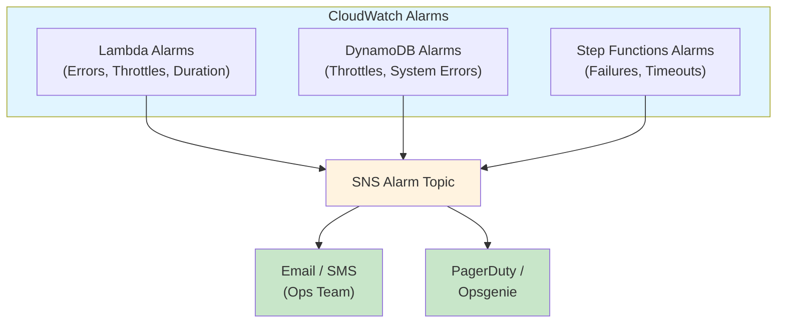

# Reliability & Error Handling Enhancements

## Overview
This update adds comprehensive error handling, monitoring, and observability to prevent silent failures and enable rapid incident response.

---

## ✅ 1. Step Functions Error Handling

### What Changed
Added **catch blocks** to all Step Functions tasks and workflows to handle failures gracefully.

### Implementation

**Failure Notification via SNS**:
```typescript
const notifyFailure = new sfnTasks.SnsPublish(scope, 'NotifyDelayFailure', {
  topic: errorTopic,
  message: sfn.TaskInput.fromObject({
    workflow: 'DelayNotification',
    error: sfn.JsonPath.stringAt('$.Error'),
    cause: sfn.JsonPath.stringAt('$.Cause'),
    input: sfn.JsonPath.entirePayload,
  }),
});
```

**DynamoDB Tasks with Error Handling**:
```typescript
const getBookings = new sfnTasks.DynamoDBQuery(scope, 'GetAffectedBookings', {
  table,
  keyConditionExpression: 'PK = :pk AND begins_with(SK, :sk)',
  // ...
}).addCatch(notifyFailure, {
  resultPath: '$.error',
});
```

**Parallel Execution with Catch**:
```typescript
const parallelExecution = new sfn.Parallel(scope, 'ProcessAndUpdate')
  .branch(checkBookings)
  .branch(updateFlight)
  .addCatch(notifyFailure, {
    resultPath: '$.error',
  });
```

### Benefits
- ✅ **No silent failures** - All errors trigger SNS notifications
- ✅ **Graceful degradation** - Workflow continues where possible
- ✅ **Error context** - Full input/output preserved for debugging
- ✅ **Automated alerts** - Ops team notified immediately

---

## ✅ 2. CloudWatch Alarms & Monitoring

### What Changed
Created `MonitoringConstruct` with comprehensive CloudWatch alarms for:
- **Lambda functions** (errors, throttles, duration)
- **DynamoDB** (throttles, system errors)
- **Step Functions** (execution failures, timeouts)

### Alarms Created

#### Lambda Alarms (per function)
| Alarm | Threshold | Period | Description |
|-------|-----------|--------|-------------|
| **Errors** | ≥5 errors | 5 min | Lambda invocation failures |
| **Throttles** | ≥5 throttles | 5 min | Concurrent execution limit reached |
| **High Duration** | ≥80% of timeout | 5 min | Execution approaching timeout |

#### DynamoDB Alarms
| Alarm | Threshold | Period | Description |
|-------|-----------|--------|-------------|
| **Read Throttles** | ≥5 throttles | 5 min | Read capacity exceeded |
| **System Errors** | ≥1 error | 5 min | DynamoDB service errors |

#### Step Functions Alarms
| Alarm | Threshold | Period | Description |
|-------|-----------|--------|-------------|
| **Execution Failures** | ≥2 failures | 5 min | Workflow executions failing |
| **Timeouts** | ≥1 timeout | 5 min | Workflow exceeding time limit |

### Architecture



### Usage

**Configure alarm email in CDK context**:
```json
{
  "context": {
    "alarmEmail": "ops-team@example.com"
  }
}
```

**Deploy with alarm notifications**:
```bash
cdk deploy -c alarmEmail=you@example.com
```

After deployment, **confirm the SNS subscription** via the email link.

---

## ✅ 3. CloudWatch Dashboard

### What's Included
Auto-generated dashboard with:
- **Lambda metrics**: Errors, throttles, invocations
- **DynamoDB metrics**: Read/write capacity, throttles
- **Step Functions metrics**: Success/failure rates, duration

### Access Dashboard
```bash
# Get dashboard URL from CloudFormation outputs
aws cloudformation describe-stacks \
  --stack-name FlightPulseStack \
  --query 'Stacks[0].Outputs[?OutputKey==`DashboardUrl`].OutputValue' \
  --output text
```

Or navigate to:  
**CloudWatch → Dashboards → FlightPulse-Monitoring**

---

## ✅ 4. SNS Topics for Error Notifications

### Topics Created

| Topic | Purpose | Subscribers |
|-------|---------|-------------|
| **flightpulse-workflow-errors** | Step Functions task failures | Configured via context |
| **flightpulse-alarms** | CloudWatch alarm notifications | Configured via context |

### Subscribe to Topics

**Via AWS Console**:
1. Navigate to **SNS → Topics**
2. Select `flightpulse-workflow-errors` or `flightpulse-alarms`
3. Click **Create subscription**
4. Choose protocol (Email, SMS, Lambda, etc.)
5. Confirm subscription

**Via CDK (automatic)**:
```typescript
const monitoring = new MonitoringConstruct(this, 'Monitoring', {
  alarmEmail: 'ops@example.com', // Auto-subscribes
  // ...
});
```

---

## 📊 Monitoring Best Practices

### 1. Set Up On-Call Rotation
- Subscribe PagerDuty/Opsgenie to SNS topics
- Configure escalation policies for critical alarms

### 2. Review Alarms Weekly
- Check dashboard for trends
- Adjust thresholds based on actual traffic

### 3. Test Failure Scenarios
```bash
# Simulate Lambda error
aws lambda invoke \
  --function-name <function-name> \
  --payload '{"test": "error"}' \
  /dev/null

# Verify alarm triggered and SNS sent
aws cloudwatch describe-alarm-history \
  --alarm-name <alarm-name> \
  --max-records 5
```

### 4. Enable X-Ray for End-to-End Tracing
All Lambdas and Step Functions have X-Ray tracing enabled:
- Navigate to **AWS X-Ray Console**
- View **Service Map** for request flows
- Drill into **Traces** for slow/failed requests

---

## 🚨 Troubleshooting

### Alarm Firing Frequently?

**Lambdas timing out**:
- Check CloudWatch Logs for specific errors
- Increase timeout or memory (current LLM messenger: 120s, 512MB)
- Review X-Ray traces for slow dependencies

**DynamoDB throttling**:
- Review consumed capacity in dashboard
- Consider switching to provisioned capacity with auto-scaling
- Add caching layer (DAX) for hot reads

**Step Functions failing**:
- Check SNS topic for error messages with full context
- Review CloudWatch Logs for individual task failures
- Test workflow with Step Functions debugger

### No Alarms Received?

1. **Verify SNS subscription confirmed**:
   ```bash
   aws sns list-subscriptions-by-topic \
     --topic-arn <alarm-topic-arn>
   ```

2. **Check alarm state**:
   ```bash
   aws cloudwatch describe-alarms \
     --alarm-names <alarm-name>
   ```

3. **Test SNS delivery**:
   ```bash
   aws sns publish \
     --topic-arn <alarm-topic-arn> \
     --message "Test alarm"
   ```

---

## 📈 Metrics to Monitor

| Metric | Target | Action if Exceeded |
|--------|--------|-------------------|
| **Lambda Error Rate** | <1% | Investigate logs, review code changes |
| **Lambda Duration** | <60% of timeout | Optimize code or increase timeout |
| **DynamoDB Throttles** | 0 | Switch to provisioned or increase on-demand capacity |
| **Step Function Success Rate** | >95% | Review workflow logic, add retries |

---

## ✅ Reliability Improvements Completed

| Enhancement | Status | Impact |
|-------------|--------|--------|
| **Step Functions catch blocks** | ✅ Complete | All errors trigger SNS notifications |
| **CloudWatch Lambda alarms** | ✅ Complete | Errors, throttles, duration monitored |
| **CloudWatch DynamoDB alarms** | ✅ Complete | Throttles and system errors detected |
| **CloudWatch Step Functions alarms** | ✅ Complete | Failures and timeouts tracked |
| **SNS error notifications** | ✅ Complete | Ops team alerted in real-time |
| **CloudWatch Dashboard** | ✅ Complete | Centralized observability |
| **X-Ray tracing** | ✅ Complete | End-to-end request tracking |

---

## 🔜 Next Steps (Observability & Maintainability)

With reliability hardened, the next phase focuses on:
- [ ] Enable API Gateway access logging
- [ ] Add standard resource tags for cost allocation
- [
] Extract bundling config helper (DRY)
- [ ] Create CDK unit tests

---

*Reliability is the foundation of trust! 🛡️*
