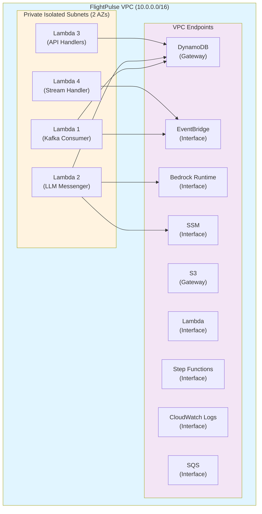

# VPC & SSM Security Enhancements

## Overview
This update adds comprehensive network security and secrets management to the FlightPulse infrastructure.

---

## ✅ 1. VPC Configuration with Private Subnets

### What Changed
Created a new `NetworkConstruct` that provides:
- **VPC with private isolated subnets** (no internet access)
- **VPC endpoints** for AWS services (no NAT gateway needed)
- **Security group** for Lambda functions

### Architecture




### Benefits
- ✅ **No internet exposure** - Lambdas run in isolated subnets
- ✅ **Cost optimization** - No NAT gateway charges (~$32/month savings)
- ✅ **Lower latency** - Direct VPC endpoint connections
- ✅ **Compliance** - Network isolation for sensitive workloads

### Files Created
- `infrastructure/lib/network-construct.ts` - Reusable VPC construct

### Files Modified
- `infrastructure/lib/flightpulse-stack.ts`:
  - All 4 Lambda functions now use VPC configuration
  - Added security group attachment

---

## ✅ 2. SSM Parameter Store for Secrets

### What Changed
- **Bedrock model ID** now stored in SSM Parameter Store instead of environment variable
- Lambda reads the parameter at runtime with IAM permissions

### Implementation

**Infrastructure (CDK)**:
```typescript
const bedrockModelParam = new ssm.StringParameter(this, 'BedrockModelId', {
  parameterName: '/flightpulse/bedrock/model-id',
  stringValue: 'anthropic.claude-3-haiku-20240307-v1:0',
  description: 'Bedrock model ID for LLM messenger Lambda',
});

bedrockModelParam.grantRead(llmMessenger);
```

**Lambda Handler** (`lambdas/python/llm-messenger/handler.py`):
```python
ssm = boto3.client('ssm')
BEDROCK_MODEL_PARAM = os.environ.get('BEDROCK_MODEL_PARAM')

def get_model_id() -> str:
    response = ssm.get_parameter(Name=BEDROCK_MODEL_PARAM, WithDecryption=True)
    return response['Parameter']['Value']

MODEL_ID = get_model_id()  # Cached for container lifetime
```

### Benefits
- ✅ **Centralized secrets** - Easy rotation without redeployment
- ✅ **Audit trail** - CloudTrail logs parameter access
- ✅ **Least privilege** - IAM controls parameter access
- ✅ **No environment variable leakage** - Secrets not visible in Lambda console

### Migration Guide
To update the model ID:
```bash
aws ssm put-parameter \
  --name /flightpulse/bedrock/model-id \
  --value "anthropic.claude-3-5-sonnet-20241022-v2:0" \
  --overwrite
```

Lambdas will pick up the new value on next cold start (no redeployment needed).

---

## 🚀 Deployment

The VPC and SSM resources are automatically created on `cdk deploy`:

```bash
# Deploy with new security features
npm run build
cdk deploy

# Verify VPC endpoints
aws ec2 describe-vpc-endpoints --filters "Name=vpc-id,Values=<vpc-id>"

# Verify SSM parameter
aws ssm get-parameter --name /flightpulse/bedrock/model-id
```

---

## 📊 Cost Impact

| Resource | Monthly Cost (us-east-1) |
|----------|-------------------------|
| VPC (free) | $0 |
| Gateway Endpoints (DynamoDB, S3) | $0 |
| Interface Endpoints (8 × $7.20) | ~$57.60 |
| SSM Parameter (Standard tier) | $0 |
| **Total additional cost** | **~$57.60/month** |

**Savings from NAT Gateway removal**: ~$32/month  
**Net additional cost**: **~$25.60/month**

### Cost Optimization Options
- Reduce interface endpoints for non-production environments
- Use shared VPC endpoints across multiple stacks (enterprise)
- Disable endpoints and use NAT gateway if cost is priority

---

## ✅ Security Improvements Completed

| Item | Status | Description |
|------|--------|-------------|
| Parameterized removal policy | ✅ Done | DynamoDB table configurable (RETAIN by default) |
| Scoped Bedrock IAM policy | ✅ Done | Region-specific ARN (no wildcard) |
| Increased LLM timeout | ✅ Done | 60s → 120s for reliability |
| **VPC with private subnets** | ✅ **Done** | Lambdas isolated from internet |
| **SSM Parameter Store** | ✅ **Done** | Bedrock model ID securely stored |

---

## 🔜 Next Steps (Reliability & Observability)

Now that security is hardened, the next phase focuses on:
- [ ] Add `catch` blocks to Step Functions
- [ ] Create CloudWatch alarms for errors/throttling
- [ ] Enable API Gateway access logs
- [ ] Apply resource tags

---

*Security enhancements complete! 🔒*
