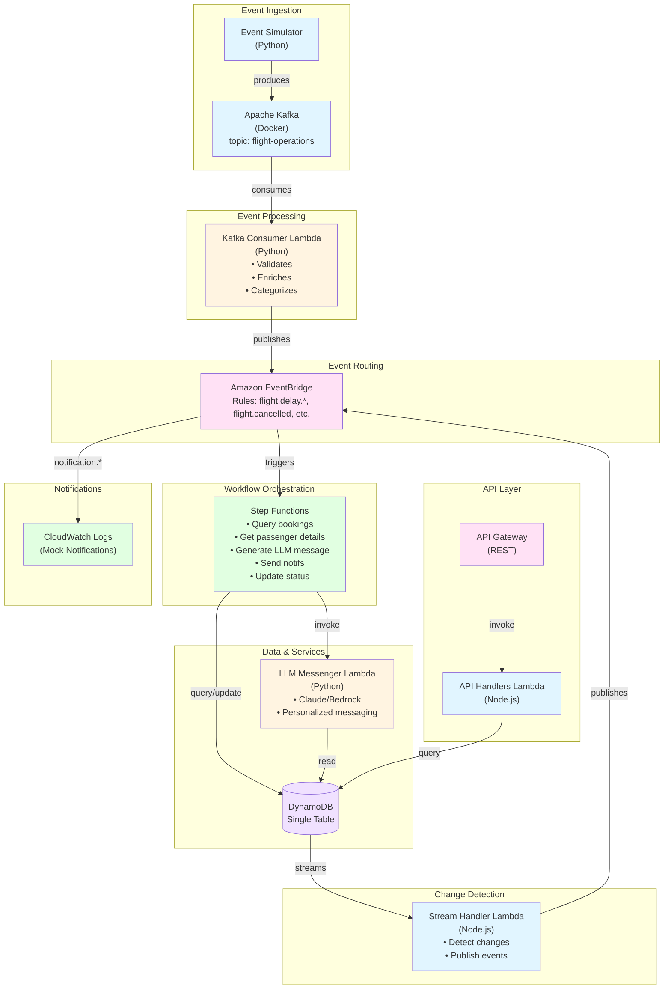
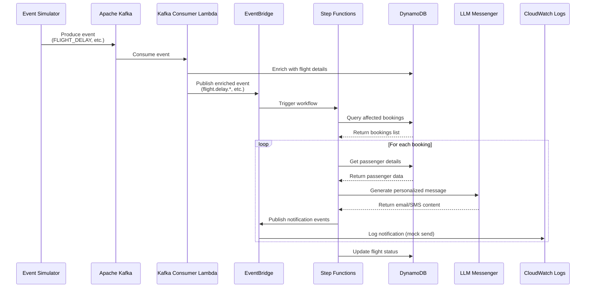
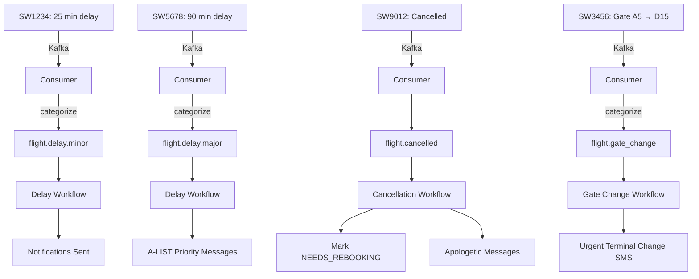

# FlightPulse - Technical Design Specification

## Project Overview

FlightPulse is a serverless, event-driven flight operations system that demonstrates modern AWS architecture patterns. The system ingests flight operation events (delays, cancellations, gate changes) from Kafka, enriches and routes them through EventBridge, orchestrates multi-step notification workflows via Step Functions, and delivers personalized passenger notifications using LLM-generated messaging.

**Purpose:** Portfolio project demonstrating proficiency in AWS serverless stack for Southwest Airlines technical interview.

**Scope:** Core event flow with working end-to-end demo capability (not production-ready).

---

## Architecture



---

### Event Flow Diagram



---

## Technology Mapping

| Component | Technology | Purpose |
|-----------|------------|---------|
| **Message Broker** | Apache Kafka (Docker) | Simulate external flight ops events |
| **Event Consumer** | AWS Lambda (Python) | Consume Kafka, enrich, publish to EventBridge |
| **Event Router** | Amazon EventBridge | Route events by type to appropriate handlers |
| **Workflow Engine** | AWS Step Functions | Orchestrate multi-step notification workflows |
| **Database** | Amazon DynamoDB | Store flights, passengers, bookings (single-table) |
| **Change Detection** | DynamoDB Streams | React to data changes, publish secondary events |
| **API Layer** | Amazon API Gateway | REST API for querying flight/booking data |
| **API Handlers** | AWS Lambda (Node.js) | Handle REST requests |
| **LLM Integration** | AWS Lambda (Python) + Bedrock | Generate personalized notification messages |
| **Infrastructure** | AWS CDK (TypeScript) | Infrastructure as code |
| **Observability** | CloudWatch, X-Ray | Logging, metrics, tracing, dashboards |
| **Local Dev** | Docker Compose | Kafka + optional LocalStack |

---

## Data Model

### Single-Table Design Overview

All entities stored in one DynamoDB table using composite keys.

**Table Name:** `FlightPulseTable`

| Attribute | Type | Description |
|-----------|------|-------------|
| PK | String | Partition key (e.g., `FLIGHT#SW1234`) |
| SK | String | Sort key (e.g., `METADATA` or `BOOKING#B123`) |
| GSI1PK | String | Status-based queries |
| GSI1SK | String | Time-based sorting |
| GSI2PK | String | Booking status queries |
| GSI2SK | String | Creation time sorting |

**Stream:** Enabled with NEW_AND_OLD_IMAGES

### Entity: Flight

**Keys:** `PK = FLIGHT#{flight_id}`, `SK = METADATA`

| Field | Type | Description |
|-------|------|-------------|
| flight_id | String | Unique identifier (e.g., SW1234) |
| origin | String | Origin airport code (e.g., DAL) |
| destination | String | Destination airport code (e.g., LAX) |
| scheduled_departure | ISO DateTime | Original departure time |
| scheduled_arrival | ISO DateTime | Original arrival time |
| actual_departure | ISO DateTime | Actual departure (null if not departed) |
| actual_arrival | ISO DateTime | Actual arrival (null if not arrived) |
| status | Enum | SCHEDULED, BOARDING, DELAYED, CANCELLED, DEPARTED, ARRIVED |
| gate | String | Current gate assignment |
| aircraft | String | Aircraft type |
| delay_minutes | Number | Current delay in minutes (0 if on time) |
| delay_reason | String | Reason code if delayed |

**GSI1:** `GSI1PK = {status}`, `GSI1SK = {scheduled_departure}`

### Entity: Passenger

**Keys:** `PK = PASSENGER#{passenger_id}`, `SK = METADATA`

| Field | Type | Description |
|-------|------|-------------|
| passenger_id | String | Unique identifier |
| first_name | String | First name |
| last_name | String | Last name |
| email | String | Email address |
| phone | String | Phone number |
| rapid_rewards_number | String | Loyalty program ID |
| tier | Enum | MEMBER, A-LIST, A-LIST_PREFERRED |
| notification_preferences | Object | { email: bool, sms: bool, push: bool } |

### Entity: Booking

**Keys:** `PK = BOOKING#{booking_id}`, `SK = METADATA`

| Field | Type | Description |
|-------|------|-------------|
| booking_id | String | Unique identifier |
| passenger_id | String | Reference to passenger |
| flight_id | String | Reference to flight |
| confirmation_number | String | 6-char confirmation code |
| seat | String | Seat assignment (e.g., 12A) |
| fare_class | String | Fare class code |
| booking_status | Enum | CONFIRMED, CHECKED_IN, CANCELLED, NEEDS_REBOOKING |
| checked_in | Boolean | Check-in status |
| bags_checked | Number | Number of checked bags |
| special_requests | List | Special assistance needs |

**GSI2:** `GSI2PK = {booking_status}`, `GSI2SK = {created_at}`

### Lookup Records (for access patterns)

**Flight → Bookings lookup:**
- `PK = FLIGHT#{flight_id}`, `SK = BOOKING#{booking_id}`
- Contains: booking_id, passenger_id

**Passenger → Bookings lookup:**
- `PK = PASSENGER#{passenger_id}`, `SK = BOOKING#{booking_id}`
- Contains: booking_id, flight_id

### Access Patterns

| Pattern | Key Condition |
|---------|---------------|
| Get flight by ID | PK = FLIGHT#xxx, SK = METADATA |
| Get passenger by ID | PK = PASSENGER#xxx, SK = METADATA |
| Get booking by ID | PK = BOOKING#xxx, SK = METADATA |
| Get all bookings for a flight | PK = FLIGHT#xxx, SK begins_with BOOKING# |
| Get all bookings for a passenger | PK = PASSENGER#xxx, SK begins_with BOOKING# |
| Get flights by status | GSI1: GSI1PK = {status} |
| Get bookings by status | GSI2: GSI2PK = {status} |

---

## Event Schemas

### Kafka Events (Inbound)

**Topic:** `flight-operations`

#### FLIGHT_DELAY

```
{
  event_id: string (uuid),
  event_type: "FLIGHT_DELAY",
  timestamp: ISO datetime,
  source: "operations_center",
  payload: {
    flight_id: string,
    delay_minutes: number,
    reason: enum (WEATHER, MECHANICAL, CREW, ATC, SECURITY, OTHER),
    reason_detail: string,
    new_departure: ISO datetime,
    new_arrival: ISO datetime
  }
}
```

#### FLIGHT_CANCELLED

```
{
  event_id: string,
  event_type: "FLIGHT_CANCELLED",
  timestamp: ISO datetime,
  source: "operations_center",
  payload: {
    flight_id: string,
    reason: enum (WEATHER, MECHANICAL, CREW, OTHER),
    reason_detail: string,
    rebooking_priority: enum (HIGH, NORMAL, LOW)
  }
}
```

#### GATE_CHANGE

```
{
  event_id: string,
  event_type: "GATE_CHANGE",
  timestamp: ISO datetime,
  source: "airport_ops",
  payload: {
    flight_id: string,
    old_gate: string,
    new_gate: string,
    terminal_change: boolean
  }
}
```

### EventBridge Events (Internal)

**Event Bus:** `flightpulse-bus`

#### Detail Types

| Detail Type | Trigger | Target |
|-------------|---------|--------|
| `flight.delay.minor` | Delay < 30 min | Step Functions |
| `flight.delay.major` | Delay 30-120 min | Step Functions |
| `flight.delay.severe` | Delay > 120 min | Step Functions |
| `flight.cancelled` | Flight cancelled | Step Functions |
| `flight.gate_change` | Gate changed | Step Functions |
| `notification.email` | Send email | CloudWatch (mock) |
| `notification.sms` | Send SMS | CloudWatch (mock) |
| `booking.status_changed` | Booking updated | CloudWatch (audit) |

#### Enriched Delay Event (published by Kafka Consumer)

```
{
  source: "flightpulse.kafka-consumer",
  detail-type: "flight.delay.major",
  detail: {
    event_id: string,
    flight_id: string,
    delay_minutes: number,
    delay_category: enum (MINOR, MAJOR, SEVERE),
    reason: string,
    reason_detail: string,
    affected_passengers_count: number,
    new_departure: ISO datetime,
    new_arrival: ISO datetime,
    flight_details: {
      origin: string,
      destination: string,
      original_departure: ISO datetime
    },
    timestamp: ISO datetime
  }
}
```

---

## Workflow Definitions

### Delay Notification Workflow

**State Machine:** `FlightPulseDelayNotification`

**Trigger:** EventBridge rule for `flight.delay.*`

**Steps:**

1. **GetAffectedBookings**
   - Type: DynamoDB Query
   - Query: All bookings for the flight (PK = FLIGHT#xxx, SK begins_with BOOKING#)
   - Output: List of booking references

2. **CheckBookingsExist**
   - Type: Choice
   - If count > 0 → ProcessBookings
   - Else → NoBookingsFound (end)

3. **ProcessBookingsInParallel**
   - Type: Map (parallel iteration)
   - MaxConcurrency: 10
   - For each booking:

   3a. **GetPassengerDetails**
       - Type: DynamoDB GetItem
       - Get passenger record for personalization

   3b. **GeneratePersonalizedMessage**
       - Type: Lambda (LLM Messenger)
       - Input: passenger details, flight event, message type
       - Output: email_subject, email_body, sms_body

   3c. **SendNotifications**
       - Type: Parallel branches
       - Branch 1: Check email preference → Publish email event
       - Branch 2: Check SMS preference → Publish SMS event

4. **UpdateFlightStatus**
   - Type: DynamoDB UpdateItem
   - Update flight record with delay info

5. **WorkflowComplete**
   - Type: Succeed

### Cancellation Workflow

**State Machine:** `FlightPulseCancellationWorkflow`

**Trigger:** EventBridge rule for `flight.cancelled`

**Steps:**

1. **GetAffectedBookings** (same as delay)

2. **MarkBookingsForRebooking**
   - Type: Map
   - Update each booking status to NEEDS_REBOOKING

3. **ProcessNotifications**
   - Type: Map (parallel)
   - For each booking: Get passenger → Generate message → Send notifications

4. **UpdateFlightStatus**
   - Set flight status to CANCELLED

5. **PublishRebookingNeeded**
   - Publish event for downstream rebooking system (future enhancement)

### Gate Change Workflow

**State Machine:** `FlightPulseGateChangeWorkflow`

**Trigger:** EventBridge rule for `flight.gate_change`

**Steps:**

1. **UpdateFlightGate**
   - Type: DynamoDB UpdateItem
   - Update gate field on flight record

2. **GetAffectedBookings**

3. **ProcessNotifications**
   - Type: Map
   - Generate and send gate change notifications
   - Priority: terminal changes get immediate SMS

---

## LLM Messenger Specification

**Purpose:** Generate personalized, empathetic notification messages based on passenger profile and event details.

**Input:**

```
{
  passenger: {
    first_name: string,
    tier: string,
    notification_preferences: object,
    special_requests: list
  },
  flight_event: {
    flight_id: string,
    type: enum (DELAY, CANCELLATION, GATE_CHANGE),
    details: object (varies by type)
  },
  message_type: enum (DELAY_NOTIFICATION, CANCELLATION_NOTIFICATION, GATE_CHANGE_NOTIFICATION)
}
```

**Output:**

```
{
  email_subject: string,
  email_body: string (2-3 paragraphs),
  sms_body: string (under 160 chars)
}
```

**Personalization Rules:**

- Address passenger by first name
- Acknowledge A-LIST / A-LIST PREFERRED status with priority language
- Mention special requests if relevant (e.g., wheelchair assistance)
- Adjust tone based on severity (minor delay = informative, cancellation = apologetic)
- Include actionable next steps

**Fallback:** If LLM fails, use templated messages with basic personalization (name only).

---

## API Specification

**Base URL:** `https://{api-id}.execute-api.{region}.amazonaws.com/prod`

### Endpoints

#### Health Check

```
GET /health

Response 200:
{
  status: "healthy",
  timestamp: ISO datetime,
  service: "flightpulse-api"
}
```

#### Get Flight

```
GET /flights/{flightId}

Response 200:
{
  flight_id: string,
  origin: string,
  destination: string,
  scheduled_departure: ISO datetime,
  scheduled_arrival: ISO datetime,
  status: string,
  gate: string,
  delay_minutes: number,
  delay_reason: string
}

Response 404:
{ error: "Flight not found" }
```

#### Get Flights by Status

```
GET /flights?status={status}

Response 200:
{
  flights: [...],
  count: number
}
```

#### Get Flight Bookings

```
GET /flights/{flightId}/bookings

Response 200:
{
  bookings: [
    { booking_id: string, passenger_id: string }
  ],
  count: number
}
```

#### Get Passenger

```
GET /passengers/{passengerId}

Response 200:
{
  passenger_id: string,
  first_name: string,
  last_name: string,
  tier: string,
  ... (excludes sensitive data)
}
```

#### Get Passenger Bookings

```
GET /passengers/{passengerId}/bookings

Response 200:
{
  bookings: [
    { booking_id: string, flight_id: string }
  ],
  count: number
}
```

#### Get Booking

```
GET /bookings/{bookingId}

Response 200:
{
  booking_id: string,
  passenger_id: string,
  flight_id: string,
  confirmation_number: string,
  seat: string,
  booking_status: string,
  ...
}
```

---

## Directory Structure

```
flightpulse/
├── README.md                          # Project overview, setup instructions
├── docker-compose.yml                 # Kafka + Zookeeper for local dev
├── package.json                       # Root package for CDK
├── cdk.json                          # CDK configuration
├── tsconfig.json                     # TypeScript config
│
├── infrastructure/                    # CDK Infrastructure Code
│   ├── bin/
│   │   └── app.ts                    # CDK app entry point
│   └── lib/
│       ├── flightpulse-stack.ts      # Main stack definition
│       └── constructs/               # Reusable constructs (optional)
│
├── lambdas/
│   ├── python/
│   │   ├── kafka-consumer/           # Consumes Kafka → EventBridge
│   │   │   ├── handler.py
│   │   │   └── requirements.txt
│   │   │
│   │   └── llm-messenger/            # Generates personalized messages
│   │       ├── handler.py
│   │       └── requirements.txt
│   │
│   └── nodejs/
│       ├── api-handlers/             # REST API handlers
│       │   ├── src/
│       │   │   └── index.ts
│       │   ├── package.json
│       │   └── tsconfig.json
│       │
│       └── stream-handler/           # DynamoDB Streams processor
│           ├── src/
│           │   └── index.ts
│           ├── package.json
│           └── tsconfig.json
│
├── step-functions/                    # State machine definitions (ASL JSON)
│   ├── delay-notification.asl.json
│   ├── cancellation.asl.json
│   └── gate-change.asl.json
│
├── simulator/                         # Event producer for testing
│   ├── producer.py                   # Kafka event producer
│   ├── scenarios.py                  # Pre-built test scenarios
│   ├── sample-data/
│   │   ├── flights.json              # Sample flight data
│   │   ├── passengers.json           # Sample passenger data
│   │   └── bookings.json             # Sample booking data
│   └── requirements.txt
│
├── scripts/
│   ├── setup.sh                      # One-time setup (install deps, etc.)
│   ├── seed-data.sh                  # Load sample data into DynamoDB
│   ├── start-local.sh                # Start Docker + local testing
│   ├── deploy.sh                     # Deploy to AWS
│   └── run-scenario.sh               # Run a test scenario
│
└── tests/
    ├── unit/
    └── integration/
```

---

## Observability Requirements

### CloudWatch Logs

- All Lambda functions log to CloudWatch
- Structured JSON logging with correlation IDs
- Log levels: INFO for normal flow, ERROR for failures

### Custom Metrics

| Metric | Unit | Description |
|--------|------|-------------|
| `DelayEventsProcessed` | Count | Delay events consumed from Kafka |
| `CancellationEventsProcessed` | Count | Cancellation events processed |
| `GateChangeEventsProcessed` | Count | Gate changes processed |
| `NotificationsSent` | Count | Total notifications dispatched |
| `LLMInvocationsSuccess` | Count | Successful LLM message generations |
| `LLMInvocationsFailed` | Count | Failed LLM calls (fallback used) |
| `WorkflowExecutions` | Count | Step Function executions |
| `AffectedPassengers` | Count | Passengers impacted per event |

### X-Ray Tracing

- Enable on all Lambda functions
- Trace Kafka consume → EventBridge → Step Functions → DynamoDB
- Capture subsegments for external calls (Bedrock)

### Dashboard

Create CloudWatch dashboard showing:
- Events processed (by type) over time
- Notification success rate
- Average workflow duration
- Error rates
- LLM fallback rate

---

## Sample Data

### Flights (5 records)

| flight_id | origin | destination | departure | status | gate |
|-----------|--------|-------------|-----------|--------|------|
| SW1234 | DAL | LAX | 2025-01-15 08:00 | SCHEDULED | A12 |
| SW5678 | HOU | DEN | 2025-01-15 09:30 | SCHEDULED | B7 |
| SW9012 | PHX | OAK | 2025-01-15 10:00 | SCHEDULED | C3 |
| SW3456 | LAS | SEA | 2025-01-15 11:15 | SCHEDULED | A5 |
| SW7890 | SAN | PDX | 2025-01-15 14:00 | SCHEDULED | B12 |

### Passengers (10 records)

Mix of tiers:
- 2 A-LIST PREFERRED
- 3 A-LIST
- 5 MEMBER

Include variety of notification preferences and special requests.

### Bookings (15-20 records)

Distribute across flights so each flight has 3-4 bookings.

---

## Test Scenarios



### Scenario 1: Minor Delay

1. Produce FLIGHT_DELAY event for SW1234 (25 min delay, WEATHER)
2. Expected: 
   - Kafka consumer enriches and publishes `flight.delay.minor`
   - Step Function queries 4 bookings
   - LLM generates personalized messages
   - Email/SMS events published
   - Flight record updated

### Scenario 2: Major Delay with A-LIST Passenger

1. Produce FLIGHT_DELAY event for SW5678 (90 min delay, MECHANICAL)
2. Expected:
   - `flight.delay.major` event
   - A-LIST passenger gets priority language in message
   - All notifications sent

### Scenario 3: Flight Cancellation

1. Produce FLIGHT_CANCELLED event for SW9012
2. Expected:
   - Cancellation workflow triggers
   - All bookings marked NEEDS_REBOOKING
   - Apologetic messages generated
   - Flight status → CANCELLED

### Scenario 4: Gate Change with Terminal Change

1. Produce GATE_CHANGE event for SW3456 (A5 → D15, terminal_change=true)
2. Expected:
   - Urgent notifications emphasizing terminal change
   - Gate updated in flight record

### Scenario 5: Rapid Sequence

1. Produce multiple events in quick succession
2. Verify system handles concurrent processing
3. Check X-Ray traces for parallel execution

---

## Acceptance Criteria

### Must Have (MVP)

- [ ] Docker Compose starts Kafka locally
- [ ] Kafka consumer Lambda processes all three event types
- [ ] EventBridge routes events to correct Step Functions
- [ ] Step Functions complete delay notification workflow end-to-end
- [ ] DynamoDB single-table design supports all access patterns
- [ ] LLM messenger generates personalized messages (with fallback)
- [ ] REST API returns flight and booking data
- [ ] CDK deploys entire stack
- [ ] At least one test scenario runs successfully

### Should Have

- [ ] DynamoDB Streams trigger secondary events
- [ ] CloudWatch dashboard operational
- [ ] X-Ray tracing shows full request flow
- [ ] All three workflow types (delay, cancellation, gate change) functional
- [ ] Simulator can run predefined scenarios

### Nice to Have

- [ ] LocalStack support for fully local testing
- [ ] Unit tests for Lambda handlers
- [ ] Integration test suite
- [ ] Cost estimation in README

---

## Implementation Notes for Claude Code

### Order of Implementation

1. **Infrastructure first:** DynamoDB table, EventBridge bus, IAM roles
2. **Data seeding:** Sample data loader script
3. **Kafka consumer Lambda:** Core event ingestion
4. **Step Functions:** Start with delay workflow only
5. **API handlers:** Basic query endpoints
6. **LLM messenger:** Add personalization
7. **DynamoDB Streams handler:** Secondary events
8. **Simulator:** Test scenario runner
9. **Observability:** Metrics, dashboard
10. **Documentation:** README with setup instructions

### Key Libraries

**Python Lambdas:**
- aws-lambda-powertools (logging, tracing, metrics)
- boto3
- pydantic (optional, for validation)

**Node.js Lambdas:**
- @aws-sdk/client-dynamodb
- @aws-sdk/lib-dynamodb
- @aws-sdk/client-eventbridge

**CDK:**
- aws-cdk-lib
- constructs

### Environment Variables

| Lambda | Variables |
|--------|-----------|
| kafka-consumer | TABLE_NAME, EVENT_BUS_NAME |
| llm-messenger | TABLE_NAME, BEDROCK_MODEL_ID |
| api-handlers | TABLE_NAME |
| stream-handler | EVENT_BUS_NAME |

### Bedrock Model

Use `anthropic.claude-3-haiku-20240307-v1:0` for cost efficiency in demo.

---

## Out of Scope (Future Enhancements)

- Actual email/SMS sending (mock with CloudWatch logs)
- Rebooking automation
- Real Kafka cluster (MSK)
- Authentication/authorization
- Multi-region deployment
- CI/CD pipeline
- Load testing
